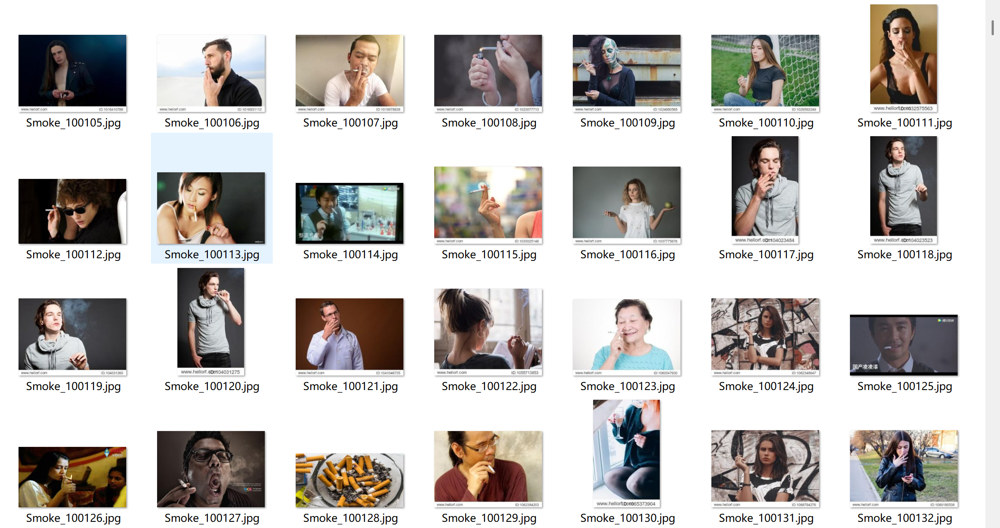
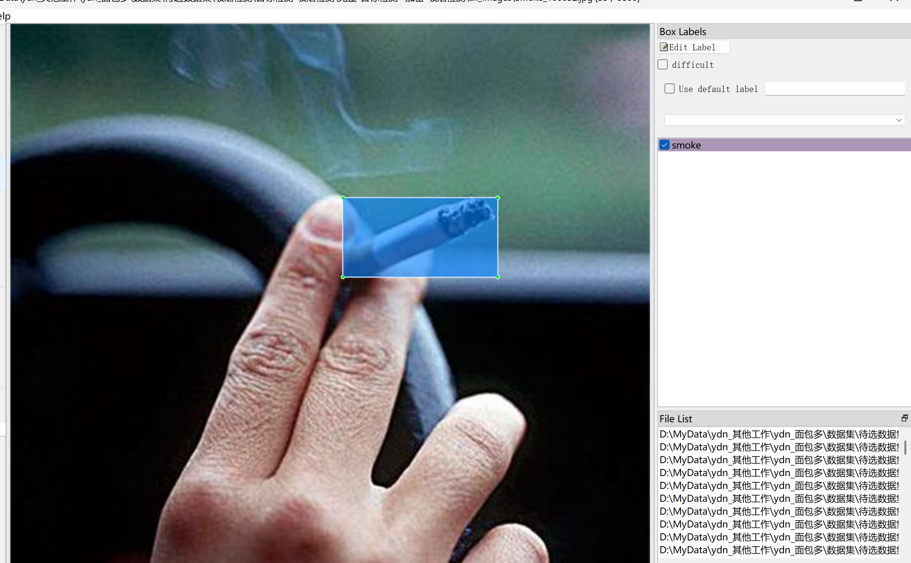

# Smoke Detection - Target Detection Dataset

Dataset Information: A total of 8,866 images and corresponding annotation files are available. The annotation files are provided in two formats: VOC-XML files and YOLO-TXT files.

Smoke: 9,318 (Smoking)
['smoke']
Note: An image may contain multiple objects, so the total number of bounding box boxes might be greater than the total number of images.

The complete dataset includes three folders and one txt file:
all_txt folder and classes.txt: Store the YOLO-TXT annotation files, with the number of files equal to the number of images, each annotation file corresponds to a single image.
classes.txt:
all_xml folder: VOC-XML annotation files. With the number of files equal to the number of images, each annotation file corresponds to a single image.

Detailed information about the VOC-XML standard files can be found on your own by searching for it on Baidu.
Both formats of annotations are usable, choose either one.
Annotation Screenshot:

The content of the image is not clear. Can you provide more details or context?

Here is a pay link on Stripe ( https://buy.stripe.com/3cs8yP7sY87d0vu9AB ). Please contact me lonlonago@foxmail.com after funding $89, and I will send you a complete data files , thank you!

